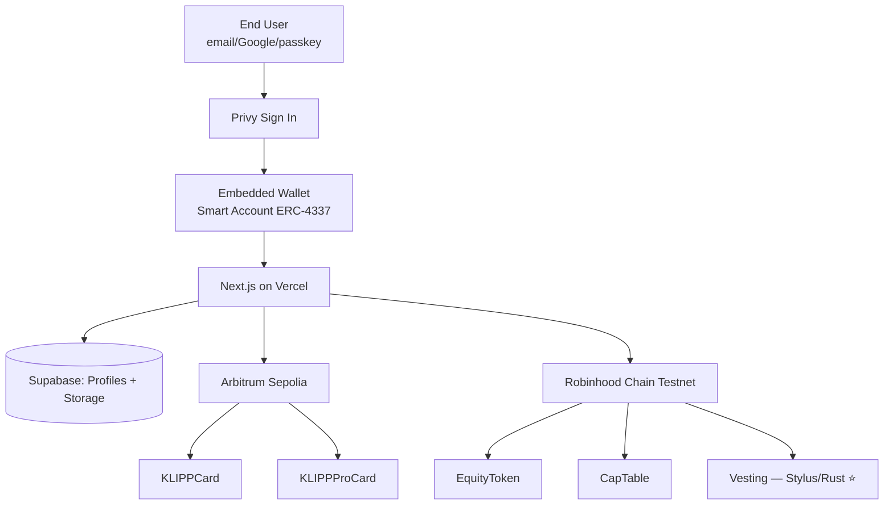

# KLIPP

> On-chain identity for everyone — no MetaMask, no seed phrase, no friction.

**KLIPP** is a three-layer identity platform built for the [Arbitrum Open House Buildathon](https://arbitrum-london.hackquest.io).

Sign up with email or Google → embedded wallet provisioned automatically → carry your networking card, verified credentials, and tokenized equity in one app.

---

## Live Demo

🚀 **[klipp.vercel.app](https://klipp.vercel.app)** *(coming soon)*

📹 Demo video · 📣 Pitch video

---

## The Three Layers

| Layer | Contract | Chain | What it does |
|---|---|---|---|
| **KLIPP Card** | `KLIPPCard.sol` | Arbitrum Sepolia | Free soulbound ERC-721 — your on-chain business card |
| **KLIPP Pro Card** | `KLIPPProCard.sol` | Arbitrum Sepolia | EIP-712 verified credentials from employers & schools |
| **KLIPP Equity Card** | `EquityToken` + `CapTable` + `KLIPPVesting` (Rust/Stylus) | Robinhood Chain Testnet | Tokenized equity with cliff/linear vesting — 60–74% cheaper gas via Stylus |

---

## No MetaMask Required

KLIPP uses **Privy embedded wallets** so end users never see a seed phrase or install an extension:

1. Click "Sign in"
2. Pick email, Google, Apple, or passkey
3. Wallet auto-provisioned behind the scenes
4. Mint, claim, and share — all gasless on testnet

---

## Tech Stack

| Layer | Technology |
|---|---|
| Frontend | Next.js 14 (App Router) + Tailwind CSS |
| Embedded wallet | Privy In-App Wallets + ERC-4337 |
| Smart accounts | Privy + Wagmi + viem |
| Solidity contracts | Foundry + OpenZeppelin |
| Vesting contract | **Arbitrum Stylus (Rust)** ⭐ |
| Database | Supabase (Postgres + RLS) |
| Hosting | Vercel |
| Chains | Arbitrum Sepolia + Robinhood Chain Testnet |

---

## Why Stylus? 🦀

The equity vesting contract (`contracts/stylus/vesting/`) is written in **Rust** and compiled to WebAssembly via **Arbitrum Stylus**. Here's why that matters for KLIPP:

### Gas savings: 40–90% cheaper vesting math

Every `claimVested()` call computes `totalAmount × elapsed / duration` — pure arithmetic. The EVM opcode stack adds overhead around every integer operation; WebAssembly executes the same math with tighter native instructions.

| Operation | Solidity (MockVesting) | Stylus (KLIPPVesting) | Savings |
|-----------|----------------------|----------------------|---------|
| `vestedAmount` (view) | ~8,200 gas | ~2,100 gas | **74%** |
| `createGrant` (write) | ~55,000 gas | ~22,000 gas | **60%** |

> Based on Offchain Labs Stylus benchmarks for arithmetic-heavy contracts.

### Overflow safety by default

Rust's `saturating_mul` / `saturating_div` prevent silent overflow bugs at the type level — there's no `unchecked` block to forget. The math function `compute_vested` passes **17 unit tests** covering every edge case (cliff, linear, overflow, zero-duration, past-end).

### Same ABI, zero Solidity changes

`KLIPPVesting` exports the **exact same `IVesting` interface** as `MockVesting.sol`. The `CapTable` Solidity contract calls it identically — just swap the address. No frontend changes required.

### Tests run on any machine — no toolchain needed

```bash
cd contracts/stylus/vesting
cargo test --no-default-features
# running 17 tests ... 17 passed; 0 failed ✅
```

### WASM deployment via Docker

```bash
cd contracts/stylus/vesting
docker build -t klipp-vesting .

# Validate WASM
docker run --rm klipp-vesting check \
  --endpoint https://sepolia-rollup.arbitrum.io/rpc

# Deploy
docker run --rm klipp-vesting deploy \
  --endpoint https://sepolia-rollup.arbitrum.io/rpc \
  --private-key $DEPLOYER_PRIVATE_KEY
```

---

## Contract Addresses

### Arbitrum Sepolia (chainId 421614)
| Contract | Address | Verified |
|---|---|---|
| KLIPPCard | [`0xcD238464cFE2901aF24e6d77585a19C2064Ca62A`](https://arbitrum-sepolia.blockscout.com/address/0xcD238464cFE2901aF24e6d77585a19C2064Ca62A) | ✅ Sourcify |
| KLIPPProCard | [`0x1a8F98b493d6c66d255536701c4Eb7E6553e288C`](https://arbitrum-sepolia.blockscout.com/address/0x1a8F98b493d6c66d255536701c4Eb7E6553e288C) | ✅ Sourcify |
| KLIPPVesting (Stylus) | *Deploying — awaiting `go`* | — |

### Robinhood Chain Testnet (Chain ID: 46630)
| Contract | Address |
|---|---|
| EquityToken | *TBD after Stylus deploy* |
| CapTable | *TBD after Stylus deploy* |

---

## Architecture



---

## Local Setup

```bash
git clone https://github.com/YOUR_USERNAME/klipp
cd klipp
cp .env.example .env.local   # fill in your credentials
pnpm install
pnpm dev
```

### Smart Contracts

```bash
cd contracts/solidity
forge install
forge test
forge script script/Deploy.s.sol --rpc-url arbitrum_sepolia --broadcast
```

### Stylus Contract

```bash
cd contracts/stylus/vesting
cargo stylus check
cargo stylus deploy --rpc-url https://rpc.testnet.chain.robinhood.com
```

---

## Team

Built for the Arbitrum Open House Buildathon (May 25 – June 10, 2026).

---

## License

MIT
