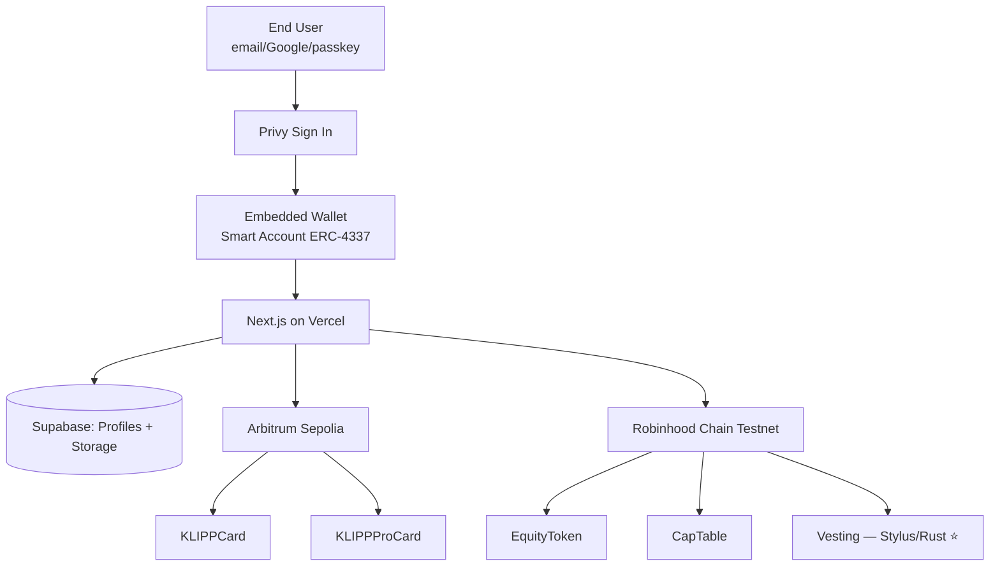

# KLIPP

> On-chain identity for everyone — no MetaMask, no seed phrase, no friction.

**KLIPP** is a three-layer identity platform built for the [Arbitrum Open House Buildathon](https://arbitrum-london.hackquest.io).

Sign up with email or Google → embedded wallet provisioned automatically → carry your networking card, verified credentials, and tokenized equity in one app.

---

## Live Demo

🚀 **[klipp.vercel.app](https://klipp.vercel.app)** *(coming soon)*

📹 Demo video · 📣 Pitch video

---

## The Three Layers

| Layer | Contract | Chain | What it does |
|---|---|---|---|
| **KLIPP Card** | `SoulboundCard.sol` | Arbitrum Sepolia | Free soulbound NFT — your on-chain business card |
| **KLIPP Pro Card** | `ProCard.sol` | Arbitrum Sepolia | EIP-712 verified credentials from employers & schools |
| **KLIPP Equity Card** | `EquityToken.sol` + `CapTable.sol` + `Vesting.rs` | Robinhood Chain Testnet | Tokenized equity with cliff/linear vesting in Stylus (Rust) |

---

## No MetaMask Required

KLIPP uses **Privy embedded wallets** so end users never see a seed phrase or install an extension:

1. Click "Sign in"
2. Pick email, Google, Apple, or passkey
3. Wallet auto-provisioned behind the scenes
4. Mint, claim, and share — all gasless on testnet

---

## Tech Stack

| Layer | Technology |
|---|---|
| Frontend | Next.js 14 (App Router) + Tailwind CSS |
| Embedded wallet | Privy In-App Wallets + ERC-4337 |
| Smart accounts | Privy + Wagmi + viem |
| Solidity contracts | Foundry + OpenZeppelin |
| Vesting contract | **Arbitrum Stylus (Rust)** ⭐ |
| Database | Supabase (Postgres + RLS) |
| Hosting | Vercel |
| Chains | Arbitrum Sepolia + Robinhood Chain Testnet |

---

## Why Stylus?

The vesting math contract (`contracts/stylus/vesting/`) is written in Rust and compiled to WASM via Arbitrum Stylus. Math-heavy vesting calculations run **40–90% cheaper in gas** on Stylus vs. Solidity. As a cap table scales to thousands of grants, this matters. KLIPP demonstrates production-grade use of Arbitrum's newest technology.

---

## Contract Addresses

### Arbitrum Sepolia
| Contract | Address |
|---|---|
| KLIPPCard | *TBD after deployment* |
| KLIPPProCard | *TBD after deployment* |

### Robinhood Chain Testnet (Chain ID: 46630)
| Contract | Address |
|---|---|
| EquityToken Factory | *TBD after deployment* |
| CapTable | *TBD after deployment* |
| Vesting (Stylus) | *TBD after deployment* |

---

## Architecture



---

## Local Setup

```bash
git clone https://github.com/YOUR_USERNAME/klipp
cd klipp
cp .env.example .env.local   # fill in your credentials
pnpm install
pnpm dev
```

### Smart Contracts

```bash
cd contracts/solidity
forge install
forge test
forge script script/Deploy.s.sol --rpc-url arbitrum_sepolia --broadcast
```

### Stylus Contract

```bash
cd contracts/stylus/vesting
cargo stylus check
cargo stylus deploy --rpc-url https://rpc.testnet.chain.robinhood.com
```

---

## Team

Built for the Arbitrum Open House Buildathon (May 25 – June 10, 2026).

---

## License

MIT
