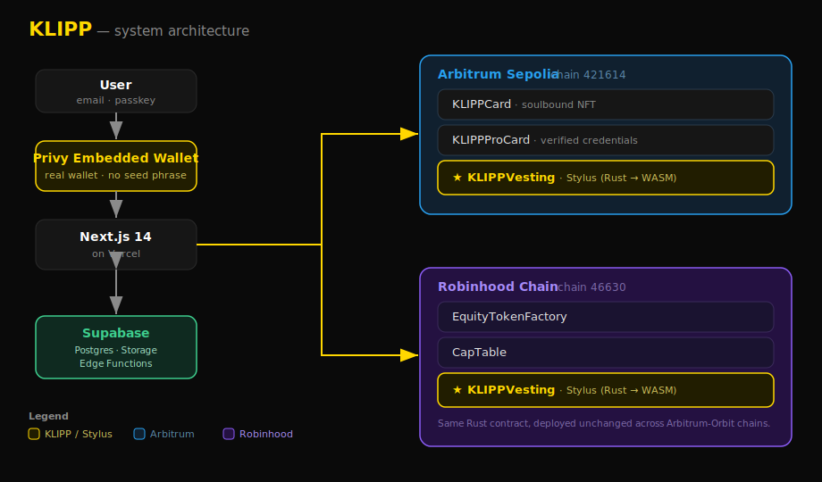
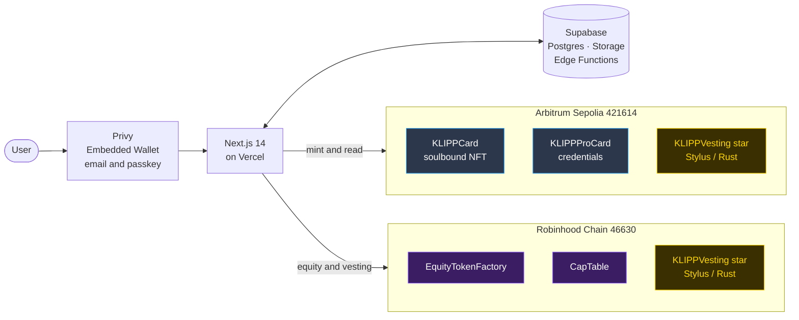

<div align="center">

# KLIPP — On-Chain Identity for the Real World

### Business card. Verified credentials. Tokenized equity. All on one chain.<br/>Sign up with email — no MetaMask required.

[](https://klipp-bay.vercel.app)
[](https://github.com/yellowwhalelabs/klipp)
[](#license)

[](https://sepolia.arbiscan.io/address/0xcD238464cFE2901aF24e6d77585a19C2064Ca62A)
[](https://explorer.testnet.chain.robinhood.com/address/0xC9DCf36D93a12F6F2D991496feB9780e13B57142)
[-FF6B35?style=flat-square)](https://arbitrum.io/stylus)

</div>

---

## What is KLIPP?

KLIPP is a three-layer on-chain identity app built for the **Arbitrum Open House Buildathon**. A user signs up with **just an email** — KLIPP provisions a real Ethereum wallet behind the scenes (via Privy), sponsors the gas, and mints them a soulbound identity card. No MetaMask. No seed phrase. No gas screen. From login to on-chain identity in under 30 seconds.

> 🚀 **Live:** [klipp-bay.vercel.app](https://klipp-bay.vercel.app)

---

## The Three Layers

### Layer 1 — KLIPP Card 🪪
Your base identity: a **soulbound (non-transferable) NFT** on Arbitrum Sepolia. Display name, avatar, and bio — your on-chain business card. One card per wallet, permanently yours.

### Layer 2 — KLIPP Pro 🎓
**Verified credentials**: EIP-712 signed claims from employers, schools, and certificate issuers, attached to your identity. Prove who you are and what you've done, cryptographically.

### Layer 3 — KLIPP Equity 📈
**Tokenized equity with vesting** — and the vesting math runs **on-chain in Rust** via an **Arbitrum Stylus** contract deployed to Robinhood Chain. Founders issue grants; the contract computes vested amounts live from the block timestamp.

---

## Architecture

<div align="center"></div>



---

## Tech Stack

| Layer | Technology |
|---|---|
| **Frontend** | Next.js 14 (App Router), React 18, TypeScript, Tailwind CSS, Framer Motion |
| **Auth & wallets** | Privy embedded wallets (email / passkey), `showWalletUIs: false` for one-click txs |
| **Chain access** | viem, wagmi, `@privy-io/wagmi` |
| **Backend** | Supabase — Postgres (profiles, funded_wallets), Storage (card images), Edge Functions |
| **Smart contracts (Solidity)** | KLIPPCard, KLIPPProCard, EquityTokenFactory, CapTable |
| **Smart contracts (Rust)** | KLIPPVesting — **Arbitrum Stylus**, compiled Rust → WASM |
| **Gasless UX** | Server-side faucet (`/api/fund-wallet`) tops up embedded wallets invisibly |
| **Infra / CI** | Vercel (hosting + preview deploys), GitHub Actions (Stylus build/deploy, grant seeding) |

---

## Deployed Contracts

### Arbitrum Sepolia (chain `421614`)

| Contract | Address | Explorer |
|---|---|---|
| KLIPPCard | `0xcD238464cFE2901aF24e6d77585a19C2064Ca62A` | [Arbiscan](https://sepolia.arbiscan.io/address/0xcD238464cFE2901aF24e6d77585a19C2064Ca62A) |
| KLIPPProCard | `0x1a8F98b493d6c66d255536701c4Eb7E6553e288C` | [Arbiscan](https://sepolia.arbiscan.io/address/0x1a8F98b493d6c66d255536701c4Eb7E6553e288C) |
| KLIPPVesting (Stylus) ⭐ | `0xAce3a7b296E41B03bC77e91D2a0375B4Ea279B80` | [Arbiscan](https://sepolia.arbiscan.io/address/0xAce3a7b296E41B03bC77e91D2a0375B4Ea279B80) |

### Robinhood Chain Testnet (chain `46630`)

| Contract | Address | Explorer |
|---|---|---|
| KLIPPVesting (Stylus) ⭐ | `0xC9DCf36D93a12F6F2D991496feB9780e13B57142` | [Blockscout](https://explorer.testnet.chain.robinhood.com/address/0xC9DCf36D93a12F6F2D991496feB9780e13B57142) |
| EquityTokenFactory | `0xcD238464cFE2901aF24e6d77585a19C2064Ca62A` | [Blockscout](https://explorer.testnet.chain.robinhood.com/address/0xcD238464cFE2901aF24e6d77585a19C2064Ca62A) |
| CapTable | `0x5e9bb5A815d2D6A81CAb1160f0A3b8BA35b4313D` | [Blockscout](https://explorer.testnet.chain.robinhood.com/address/0x5e9bb5A815d2D6A81CAb1160f0A3b8BA35b4313D) |

> Source of truth: [`deployments/sepolia.json`](deployments/sepolia.json) and [`deployments/robinhood-testnet.json`](deployments/robinhood-testnet.json).

---

## Why Stylus?

KLIPP's vesting engine is written in **Rust** and deployed with **Arbitrum Stylus** — the same EVM state, executed in a WASM runtime alongside the EVM.

- **Cheaper gas.** Stylus contracts can be **~40–90% cheaper** on compute-heavy logic than the Solidity equivalent. Vesting math — multiply/divide over large token amounts on a time curve — is exactly the kind of arithmetic that benefits.
- **Newest Arbitrum tech.** Stylus is Arbitrum's frontier runtime; KLIPP uses it for the layer where performance and cost matter most.
- **Live, verifiable, on-chain math.** `vestedAmount(grantId, timestamp)` recomputes from the current block timestamp on every read — the vested figure visibly ticks up in the UI, not a cached snapshot.
- Among the **first Stylus deployments on Robinhood Chain** (46630), proving the same Rust contract ships unchanged across Arbitrum-Orbit chains.

---

## Test Coverage

| Suite | Result |
|---|---|
| Solidity contracts (Foundry) | **37 / 37 passing** ✅ |
| Rust / Stylus vesting (`cargo test`) | **17 / 17 passing** ✅ |

Rust unit tests cover the pure `compute_vested` routine (cliff, linear, pre-start, overflow, zero-duration, past-end) and run on any host with no Stylus toolchain.

---

## Local Setup

```bash
# 1. Clone
git clone https://github.com/yellowwhalelabs/klipp.git
cd klipp

# 2. Install (pnpm workspace)
pnpm install

# 3. Configure env
cp apps/web/.env.example apps/web/.env.local
#   then fill in: NEXT_PUBLIC_PRIVY_APP_ID, Supabase keys,
#   contract addresses, and DEPLOYER_PRIVATE_KEY (server-only)

# 4. Run the web app
pnpm --filter web dev          # http://localhost:3000

# 5a. Solidity tests (Foundry)
forge test --root contracts/solidity

# 5b. Rust / Stylus vesting tests (no toolchain needed)
cargo test --manifest-path contracts/stylus/vesting/Cargo.toml --no-default-features
```

Requires Node ≥ 20, pnpm 9, Rust 1.90 (for Stylus), and Foundry.

---

## Roadmap

- **Phase 1 — Buildathon (done ✅)** — Email onboarding + embedded wallets, soulbound KLIPP Card, gasless minting, Rust/Stylus vesting deployed on Arbitrum Sepolia **and** Robinhood Chain, live equity dashboard reading on-chain vesting.
- **Phase 2 — Mainnet** — Ship to Arbitrum One + a production Stylus chain, real EIP-712 credential issuers, token-backed vesting with on-chain `claim()`, and account recovery.
- **Phase 3 — Secondary market** — Compliant secondary market for vested equity, a credential marketplace, and org/cap-table tooling for founders.

---

## Team

**Muthu Selvan** — design, full-stack, smart contracts. ([Yellow Whale Labs](https://github.com/yellowwhalelabs))

---

## License

Released under the **MIT License**. See [`LICENSE`](LICENSE).
